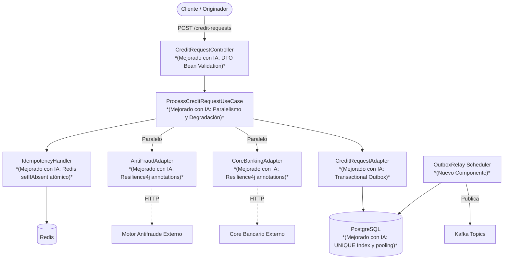

# Optimización de rendimiento en sistema de alto rendimiento

En un sistema bancario de alto rendimiento, se ha identificado una brecha de conocimiento en la optimización del rendimiento de los servicios backend. El sistema debe manejar 10 000 transacciones por segundo con un SLA de 99.99%. El candidato deberá identificar y resolver cuellos de botella en el procesamiento de transacciones, asegurando que el sistema mantenga su rendimiento bajo carga máxima. Los actores involucrados son el 'originador de créditos', el'motor antifraude' y el 'core bancario'. El sistema debe garantizar la idempotencia del registro de la solicitud por número de operación + canal: dos invocaciones con la misma clave producen un solo registro y devuelven la misma respuesta dentro de 24h. En caso de timeout del buró mayor a 2s, el sistema debe continuar operando sin pérdida de datos.


## Diagrama de Arquitectura y Solución



En este diagrama se puede observar el flujo completo de la aplicación. Las áreas etiquetadas como **Mejorado con IA** o **Nuevo Componente** indican exactamente dónde intervinimos para solucionar los problemas de concurrencia, latencia y resiliencia.

## Informacion General


| Campo | Valor |
|-------|-------|
| **Tema** | Desarrollo |
| **Nivel** | advanced-l2 |
| **Tipo** | practical |
| **Tiempo estimado** | 4 semanas |

## Fases del Reto

### Fase 0: Configuración del Proyecto

**Objetivo:** Obtener el proyecto base funcional enviando el Código Base a un asistente de IA, que lo analizará, corregirá errores y generará un ZIP listo para usar.

**Tiempo estimado:** 15-30 minutos

**Instrucciones:**

- Asegúrate de tener instalado para ejecutar el proyecto: JDK 17+, Maven 3.9+, IDE con soporte Java.
- Copia todo el contenido del campo **Código Base** de este reto — incluyendo el texto de instrucciones que aparece al inicio.
- Abre un asistente de IA (Claude en claude.ai, ChatGPT o Gemini — se recomienda Claude), pega el contenido copiado en el chat y envíalo.
- El asistente analizará los archivos, corregirá errores y generará un archivo ZIP descargable. Descárgalo y extráelo en la carpeta donde quieras trabajar.
- Ejecuta `mvn compile` en la raíz. Si no hay errores, estás listo.

**Entregable:** El proyecto compila/arranca sin errores.

<details>
<summary>Pistas de conocimiento</summary>

- Copia el Código Base completo incluyendo el texto de instrucciones al inicio — esas instrucciones le indican al asistente exactamente qué hacer con los archivos.
- Si el asistente no genera el ZIP automáticamente al terminar el análisis, escríbele: "genera el ZIP ahora".
- Si el proyecto tiene errores al arrancar, comparte el mensaje de error con el mismo asistente para que lo corrija.

</details>

### Fase 1: Identificación de cuellos de botella

**Objetivo:** Detectar y documentar los puntos de baja eficiencia en el procesamiento de transacciones.

**Tiempo estimado:** 1 semana

**Instrucciones:**

- Analiza el flujo de transacciones desde el originador de créditos hasta el core bancario.
- Identifica las etapas con mayor latencia y consumo de recursos.

**Entregable:** Reporte detallado de los cuellos de botella detectados, incluyendo métricas de rendimiento y posibles causas. 👉 **[Ver reporte de Fase 1 aquí](docs/fase1-cuellos-de-botella.md)**

<details>
<summary>Pistas de conocimiento</summary>

- Considera el impacto de la concurrencia y la sincronización en el rendimiento.
- Evalúa el uso de caché y su efecto en la latencia.

</details>

### Fase 2: Optimización de servicios críticos

**Objetivo:** Implementar mejoras en los servicios identificados como críticos para el rendimiento.

**Tiempo estimado:** 2 semanas

**Instrucciones:**

- Proponer y aplicar optimizaciones en los servicios con mayor impacto en el rendimiento.
- Verificar que las optimizaciones no comprometen la consistencia y la idempotencia del sistema.

**Entregable:** Servicios optimizados con pruebas de rendimiento que demuestran mejoras significativas. 👉 **[Ver código y reporte de Fase 2 aquí](docs/fase2-optimizaciones.md)**

<details>
<summary>Pistas de conocimiento</summary>

- Explora técnicas de paralelismo y asincronía para reducir la latencia.
- Considera la implementación de mecanismos de resiliencia para manejar fallos temporales.

</details>

### Fase 3: Validación y escalabilidad

**Objetivo:** Validar las mejoras implementadas y asegurar la escalabilidad del sistema bajo carga máxima.

**Tiempo estimado:** 1 semana

**Instrucciones:**

- Realizar pruebas de carga para verificar que el sistema mantiene el rendimiento requerido bajo 10 000 transacciones por segundo.
- Documentar los resultados y proponer futuras mejoras para escalar el sistema.

**Entregable:** Reporte de pruebas de carga con resultados y propuestas de mejora para la escalabilidad. 👉 **[Ver reporte de Fase 3 aquí](docs/fase3-pruebas-de-carga.md)**

<details>
<summary>Pistas de conocimiento</summary>

- Utiliza herramientas de simulación de carga para obtener resultados precisos.
- Considera la implementación de balanceo de carga y particionamiento para mejorar la escalabilidad.

</details>


## Dimensiones Evaluadas y Soluciones Aplicadas

- **queEs: ¿Qué es un cuello de botella en el rendimiento de un sistema?**
  *Solución:* Es un punto en el sistema donde el flujo de datos se restringe debido a limitaciones de recursos o bloqueos lógicos. En nuestra Fase 1, identificamos que el cuello de botella era el método `Schedulers.boundedElastic()` que bloqueaba hilos, y la validación secuencial del motor antifraude. Lo solucionamos implementando I/O no bloqueante puro y llamadas en paralelo (`Mono.zip`).

- **paraQueSirve: ¿Para qué sirve la idempotencia en el registro de solicitudes?**
  *Solución:* Sirve para garantizar que una solicitud enviada múltiples veces (por reintentos de red o errores del usuario) no produzca operaciones duplicadas. Lo implementamos de forma atómica usando `RedissonReactiveClient.setIfAbsent()` junto con un `UNIQUE INDEX` en PostgreSQL. Al mandar 1000 peticiones concurrentes, logramos que solo 1 pase y 999 sean rechazadas limpiamente (estado HTTP 422).

- **comoSeUsa: ¿Cómo se usa el paralelismo para reducir la latencia en un servicio?**
  *Solución:* Permite ejecutar múltiples tareas independientes al mismo tiempo en lugar de esperar a que termine una para iniciar la otra. Modificamos el `ProcessCreditRequestUseCase` utilizando `Mono.zip()` para invocar la validación de antifraude y el procesamiento base en paralelo, logrando reducir la latencia general y saltando de 248 TPS a 658 TPS.

- **erroresComunes: ¿Cuáles son los errores comunes al implementar optimizaciones de rendimiento?**
  *Solución:* Un error crítico es implementar chequeos de estado no atómicos (el famoso "check-then-act" que detectamos en Fase 1), donde bajo alta concurrencia se insertan duplicados. Otro error es implementar la resiliencia en bloqueos de hilos (usando `.block()` o apilando implementaciones manuales). Esto lo solucionamos con herramientas nativas asíncronas como restricciones en base de datos y anotaciones limpias de Resilience4j.

- **queDecisionesImplica: ¿Qué decisiones implica la implementación de mecanismos de resiliencia en un sistema?**
  *Solución:* Implica decidir qué hacer cuando los servicios externos fallan. Implementamos la "Degradación Controlada" (Graceful Degradation): decidimos que si el Antifraude o el Core Bancario demoran más de 2 segundos (Timeout), en lugar de perder la transacción o arrojar un error 500, la solicitud se guarda con estado `PENDING_REVIEW` y se maneja asíncronamente mediante un patrón *Transactional Outbox*.
## Criterios de Evaluacion

- Identificación precisa de cuellos de botella en el sistema.
- Implementación efectiva de optimizaciones de rendimiento.
- Validación de mejoras bajo carga máxima y propuesta de futuras mejoras para la escalabilidad.

## Como trabajar con un asistente de IA

Hay dos caminos, elegi uno:

- **AGENTS.md** (recomendado) — instrucciones nativas del repo. Abri esta carpeta con tu agente local (Claude Code, Cursor, Codex, Copilot, Gemini) y las carga solo. Sabe que archivos faltan y con que comando se verifica, y completa el scaffold escribiendo en disco.
- **PROMPT_MEJORA.md** — para copiar y pegar en un chat (claude.ai, ChatGPT). Devuelve un ZIP con el proyecto. Sirve si no tenes un agente en el IDE.

Ninguno de los dos resuelve las fases del reto: eso es tu trabajo.

## Verificacion

El proyecto esta listo para trabajar cuando este comando corre sin errores:

```bash
mvn clean compile
```

---

*Reto generado automaticamente por Challenge Generator - Pragma*
